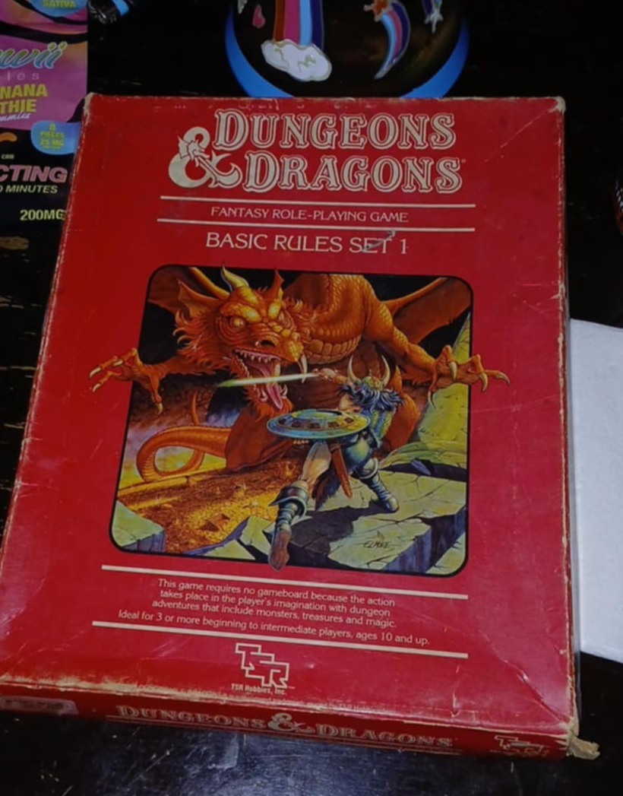

# slay-the-dagron
#### Project Unit 1 General Assembly, a java game

## How to play
[Live Deploy of Game Here](https://macfarley.github.io/slay-the-dagron/)

[GitHub Repository](https://github.com/macfarley/slay-the-dagron)
>With these files you can host the game remotely or edit the source code yourself.

Choose an action
* Attack (Spear)
* Defend (Shield)
* Heal (Potion)
* Flee (boots)
* Reset Game (this also runs on page reload)
### How to Win
There are 3 counters in the center of the screen:
1. Dagron HP, you win when you bring the dragon to 0 or below health. VICTORY will display.
1. Warrior HP, this is you, the player.  If your health drops to 0 or below you lose. GAME OVER
1. Villagers Left, they are the reason you fight.  Without anybody to defend, you are lost and GAME OVER.

## How it works
The game renders a new round every time the player makes a choice, a 'click' on the action buttons or icons.  The game uses Javascript to simulate dice rolling from the Dungeons and Dragons Open Gaming License with polyhedral dice.  A cube (6 sided), decahedron (10 sided), or icosahedron (20 sided) die can be siumalated with the Math.floor and Math.random built-in methods.
### Player Actions
* Spear Attack damages the Dagron if it hits.
* Defend halves incoming damage this round, protects villagers from collapsing buildings.
* Heal restores some warrior HP.
* Fleeing is only for cowards.
### Dagron Actions
The warrior's action resolves, then the Dagron performs a random action.
* Bite Attack only damages the player.
* Tail Attack damages the player and any villagers in the way.
* Flying takes the Dagron out of spear range for the next round.
* Dagron smashing buildings does not hurt the warrior but can cause a lot of casualties.
* Fire breath causes a lot of damage to the Warrior and random villagers, but the dragon must take time to breathe in deeply before it can use fire again.
> The game displays the consequences of the player and Dagron actions in the text window, and updates the game state on the counters.  When any of the 3 counters reaches 0 the game is done, whether in victory or defeat.

## How it was built
I wanted to build a combat turn-based game with an art style like a vintage text-based adventure computer game, styled after Dungeons and Dragons using OGL mechanics like attack rolls.

HTML will display the state of the game to the player, arranged with CSS styles that display the text adventure on a background image of the Dagron.

Javascript supplies the interactive language for the game to respond to user input.
1. Upon Loading it should display a message to the player "A terrifying Dagron has beset the village, is smashing buildings and eating villagers."
And then a short how to play "ATTACK with spears to Slay the Dagron, Take Cover behind your shield to DEFEND against incoming damage, or Drink a Vitality Potion to HEAL."
2. Below the messages will be 4 player action buttons: a spear labeled ATTACK, a shield labeled DEFEND, a bottle labeled HEAL, and a winged foot labeled FLEE.
3. To win, the player must bring the Dagron's HP to 0 or lower, at which point the game displays "That last spear pierces the heart of the beast, and it falls dead to the ground. VICTORY! You have slain the mighty Dagron and save the Village.  The (number) remaining villagers will surely immortalize your name in song, just as soon as they extinguish their homes."
4. There are 3 losing conditions: 
    + If the player chooses FLEE they're treated to warrior message for their cowardice.  "You live to fight another day, but at what cost?  You may have survived, but the Village is lost.
    GAME OVER", set gameOver = true
    + If the Player's HP reaches 0 or below the player receives the warrior message "Seeing their most capable warrior lain low by the Dagron, the remaining (number) Villagers flee into the countryside.  Your heroic sacrifice would surely be remembered in song, if the Dagron hadn't burned all the instruments.", set gameOver = true
    + If the player survives but the last villager is killed, the FLEE message displays as the player has nobody left to defend., set gameOver = true
5. The winning/losing state is determined by 3 counters displayed to the user: Player HP, Dagron HP, Villagers remaning. A function will check each counter against <=0 after each click on any of the 4 buttons.

6. I added a fun easter egg: if you hover over the Dagron picture text displays telling you to click for a sound, and the game plays a Dagron Roar .wav file.
7. The function handleClick() will trigger each time the buttons are clicked,
it will fire off other functions based on which button the player chose.  If gameOver == true, dragonMsg = "GAME OVER", set the reset button text to "PLAY AGAIN?" with bigger text.
* FLEE: skip down to display a defeat message.
* HEAL: add health to the player's count.
* ATTACK: spear attack(check if flying=true, attack roll, damage roll). subtract damage from dagron's health counter.
* DEFEND: set shield= true, dragon attacks this round do half damage, or saves villagers in a building-smash attack.
* At the bottom is a "Reset Game" button that changes
* Update the HP and Villager display counters.
* Check for victory/loss and display to the user.

## Accessability Concerns
1. Checked the background hue vs. font of the least contrasting areas (dark red on tan) into a contrast checking site and achieved 5.7, which exceeds AA compliance to The W3C Web Content Accessibility Guidelines 2.0 
[contrast test](https://webaim.org/resources/contrastchecker/?fcolor=8B0000&bcolor=DEBF92)
    
2. Action buttons for the player: each action button and icon image which are clickable are at least 44pixels on the shortest size, which satisfies 
3. Website functionality is operable by keyboard.
## Attributions
Special Thanks to: 
[Vecteezy](https://www.vecteezy.com/free-png/Spear) for Spear, Shield, Boots, Potion pngs, Parchment background.
[freesound](https://freesound.org/s/789094/) for Eithra: Dragon-Cry by Kataoneon License: Attribution 4.0
[Gary Gygax](https://www.dndbeyond.com/resources/1781-systems-reference-document-srd?srsltid=AfmBOorZaa0t9Y_SFHkjgPWAzsP0dNs1M2kpZ1VDyLcEYfRJ_Y7Ne_F7) for all his contributions to geek culture starting with the original Dungeons and Dragons.

## Stretch Goals
In the future I intend to add a more variable start state for different difficulty levels, then expanding the franchise to other classic monsters like a Hydra, Minotaur, the deadly Gazebo.
For features I would like to add more sound with a mute button option, as well as a dark or high-contrast mode.